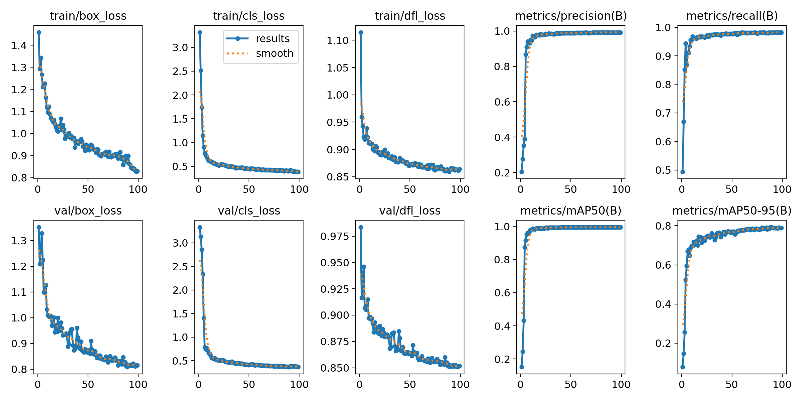

# RebarCount - 钢筋计数应用

基于 YOLOv11 和 MNN 框架的 iOS 钢筋自动计数应用。


## 功能特性

- 🔍 **智能检测**: 使用 YOLOv11 模型自动识别图像中的钢筋
- 📊 **自动计数**: 准确统计检测到的钢筋数量
- 🏷️ **智能标记**: 按从上到下、从左到右的顺序为每根钢筋编号
- 📱 **原生体验**: 基于 iOS 原生开发，流畅的用户体验
- ⚡ **高性能**: 使用 MNN 框架进行模型推理，速度快、内存占用低

## 技术架构

- **开发语言**: Swift + Objective-C++
- **AI 框架**: MNN (Mobile Neural Network)
- **模型**: YOLOv11n (轻量化版本)
- **平台**: iOS 13.0+
- **开发工具**: Xcode

## 核心功能

### 1. 图像预处理

- 自动调整图像尺寸至 640x640
- 中心填充保持宽高比
- 像素值归一化处理

### 2. 模型推理

- 使用 YOLOv11n 模型进行目标检测
- 输出边界框坐标、置信度和类别信息

### 3. 后处理

- 非极大值抑制 (NMS) 去除重复检测
- 坐标转换回原始图像尺寸
- 按空间位置排序 (从上到下，从左到右)

### 4. 结果可视化

- 绘制红色边界框
- 在每个检测目标中心显示编号
- 圆形背景突出显示数字标记

## 使用方法

1. **打开应用**: 启动 RebarCount 应用
2. **选择图片**: 点击选择按钮，从相册选择包含钢筋的图片
3. **自动检测**: 应用会自动处理图片并检测钢筋
4. **查看结果**: 检测完成后显示标记了编号的结果图片
5. **获取计数**: 应用会显示检测到的钢筋总数

## 安装要求

- iOS 13.0 或更高版本
- Xcode 12.0 或更高版本
- 支持的设备: iPhone 6s 及以上

## 编译运行

1. 克隆项目到本地

```bash
git clone [项目地址]
cd RebarCount
```

2. 使用 Xcode 打开项目

```bash
open RebarCount.xcodeproj
```

3. 选择目标设备或模拟器
4. 点击运行按钮 (⌘+R) 编译并运行

## 模型信息

- **模型类型**: YOLOv11n
- **输入尺寸**: 640×640×3
- **输出格式**: [1, 84, 8400] (坐标 + 置信度 + 类别)
- **模型大小**: 约 6MB
- **推理速度**: < 100ms (iPhone 12)

## 模型微调

- 数据集：[https://github.com/linghugoogle/RebarCountDataset](https://github.com/linghugoogle/RebarCountDataset)
- 微调


## 性能优化

- 使用 MNN 框架进行模型加速
- 图像预处理优化，减少内存拷贝
- 智能缓存机制，避免重复计算
- 多线程处理，保持 UI 响应

## 注意事项

- 确保图片中钢筋清晰可见
- 避免严重遮挡或重叠的钢筋
- 光照条件良好时检测效果更佳
- 建议图片分辨率不低于 640×640

## 开发者

- 开发语言: Swift 5.0+, Objective-C++
- 框架依赖: MNN, UIKit, CoreGraphics
- 最低部署目标: iOS 13.0

## 许可证

本项目仅供学习和研究使用。

如有问题或建议，欢迎提交 Issue 或 Pull Request。
